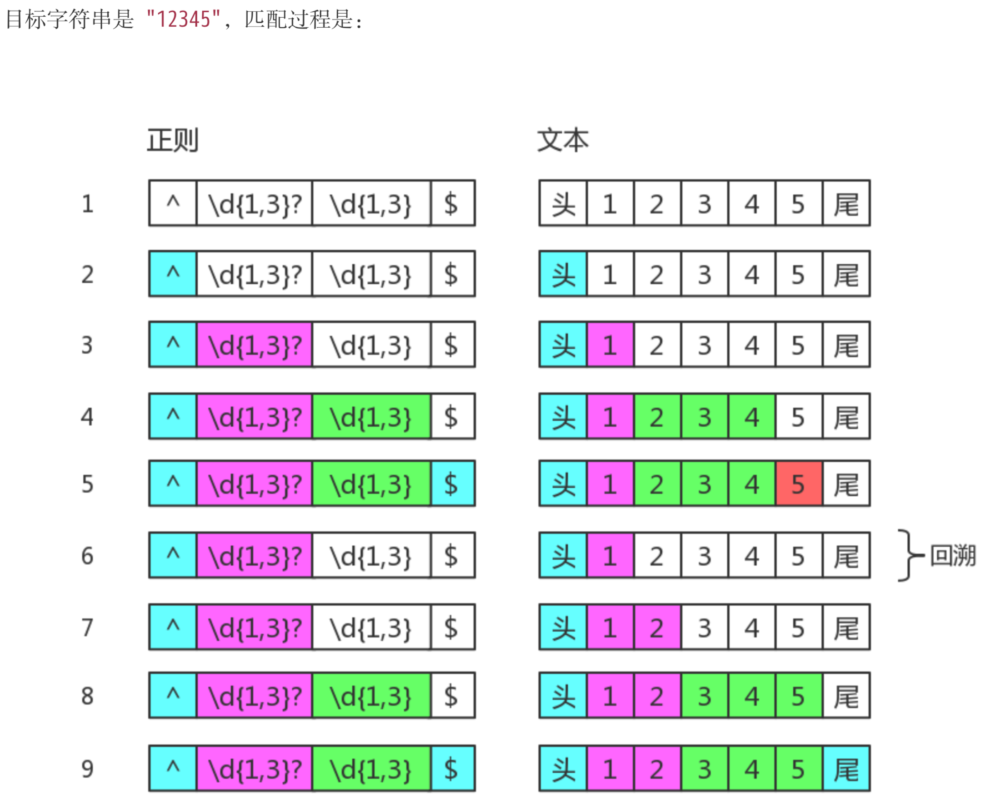

# 第四章 正则表达式回溯法原理
正则表达式匹配字符串的这种方式，有个学名，叫回溯法
本质上就是深度优先搜索算法。其中退到之前的某一步这一过程，我们称为“回溯”
```javascript
var string = "12345";
var regex = /(\d{1,3}?)(\d{1,3})/;
console.log( string.match(regex) );
// => ["1234", "1", "234", index: 0, input: "12345"]
```



## 参考
- [JavaScript正则表达式迷你书-第四章](https://github.com/qdlaoyao/js-regex-mini-book)
