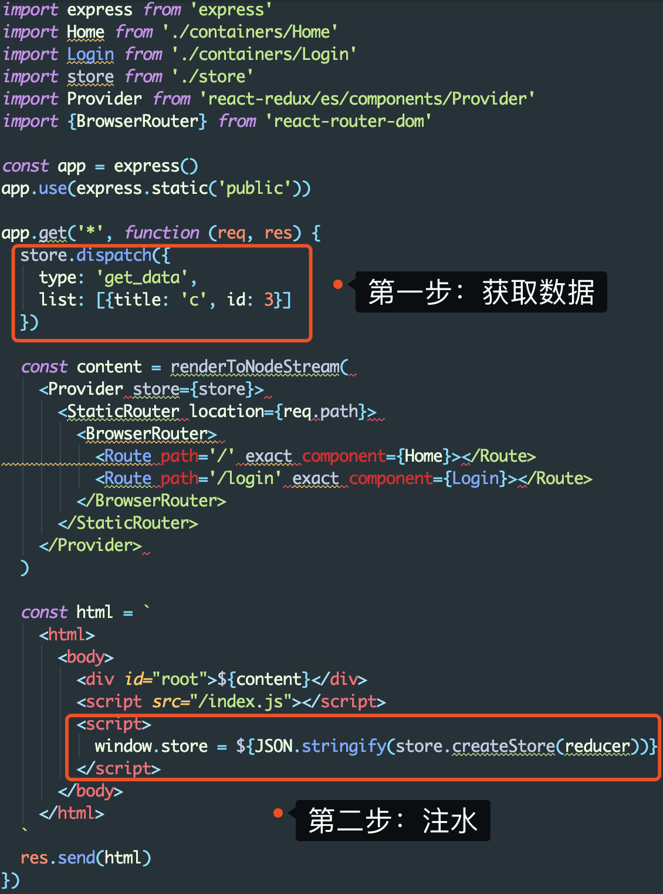
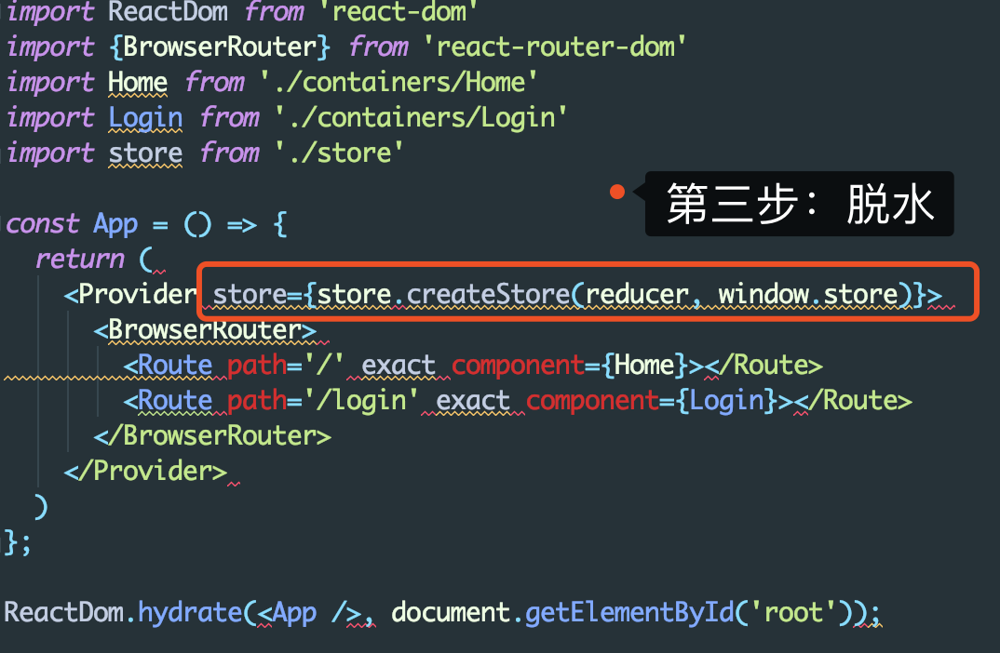

# 服务端渲染
- 浏览器渲染（CSR）：页面渲染是JS负责进行的
- 服务端渲染（SSR）：服务器端直接返回HTML让浏览器直接渲染

传统CSR的弊端：
1. 拉取并且执行js代码，导致首屏加载时间长
2. 无法SEO，搜索引擎爬虫只认识html结构的内容，而不能识别JS代码内容

流程：
- 使用ReactDOM的renderToString把React元素转化为字符串
- 服务器直接返回此字符串

## 问题1：事件失效
因为：react-dom/server下的renderToString并没有做事件相关的处理，因此返回给浏览器的内容不会有事件绑定
解法：同构。就是一套React代码在服务器上运行一遍，到达浏览器又运行一遍。服务端渲染完成页面结构，浏览器端渲染完成事件绑定。
- 使用ReactDom.hydrate方法来渲染React，打包。
- 在服务器返回的html结构中以script方式引入此打包文件

## 问题2：路由问题
服务端路由需要包裹 `StaticRouter`

## 问题3：状态管理
因为：由于服务端不会执行 `componentDidMount` 方法，假如再次请求数据，会导致服务端渲染的和客户端渲染的不一致。
解法：数据注水和脱水
- 注水：在服务端获取所需要的数据，渲染成html。并且把数据保存在返回的html结构中。例如：window.store
- 脱水：在客户端渲染中的store取window.store的数据来作为初始化数据

## 问题4：如何在服务端渲染中使用css
同理，使用内联样式或者嵌入式样式即可。（react中可用isomorphic-style-loader）

## 参考
- [从头开始，彻底理解服务端渲染原理(8千字汇总长文)](https://juejin.im/post/5d1fe6be51882579db031a6d?utm_source=gold_browser_extension#heading-0)
