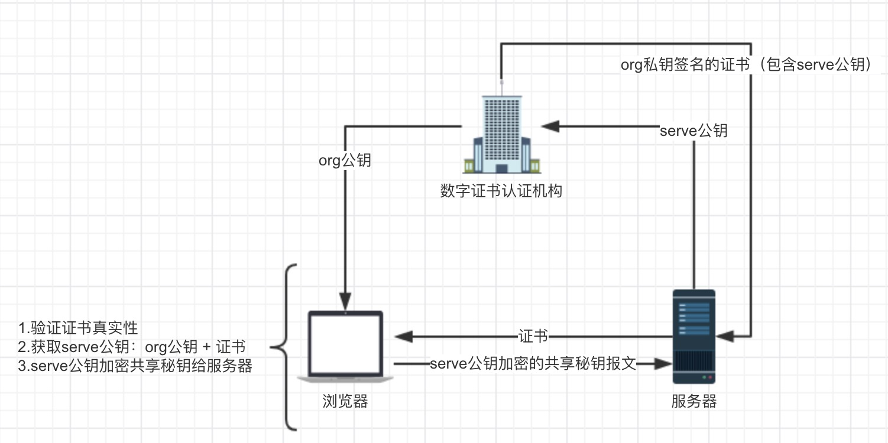

# https
https = http + ssl

## 加密方式
对称加密：双方都有钥匙
非对称加密：只有一方有钥匙

## 风险
http是明文通信的，所有如下风险
- 窃听风险（eavesdropping）：第三方可以获知通信内容。
- 篡改风险（tampering）：第三方可以修改通信内容。
- 冒充风险（pretending）：第三方可以冒充他人身份参与通信

SSL/TLS协议：
* 传输加密：解决窃听风险
* 校验机制：解决篡改风险
* 证书验证：解决冒充风险

## 加密过程

Https的建立过程：http -> ssl -> tcp -> ip

准备工作：
1. 服务器把serve公钥向数字证书认证机构申请证书
2. 申请成功后，认证机构用org私钥签名的serve公钥的证书给服务器

流程：
1. 浏览器 -> 服务器
    1. 协议版本号
    2. 客户端支持的加密方法
2. 服务器 -> 服务器
    1. 确认双方使用的加密方法
    2. 认证机构派发的证书给浏览器
3. 浏览器 -> 服务器
    1. 验证证书的真实性：自身包含认证机构的org公钥，使用org公钥解密证书
    2. 生成共享秘钥（建立https链接后以共享秘钥来加密报文信息）
    3. 使用解密证书得到的服务器公钥加密共享秘钥
4. 浏览器和服务器都拥有serve公钥和共享秘钥，开始加密通信

## 参考
[HTTPS从认识到线上实战全记录](https://www.cnblogs.com/liuxianan/p/https.html)
