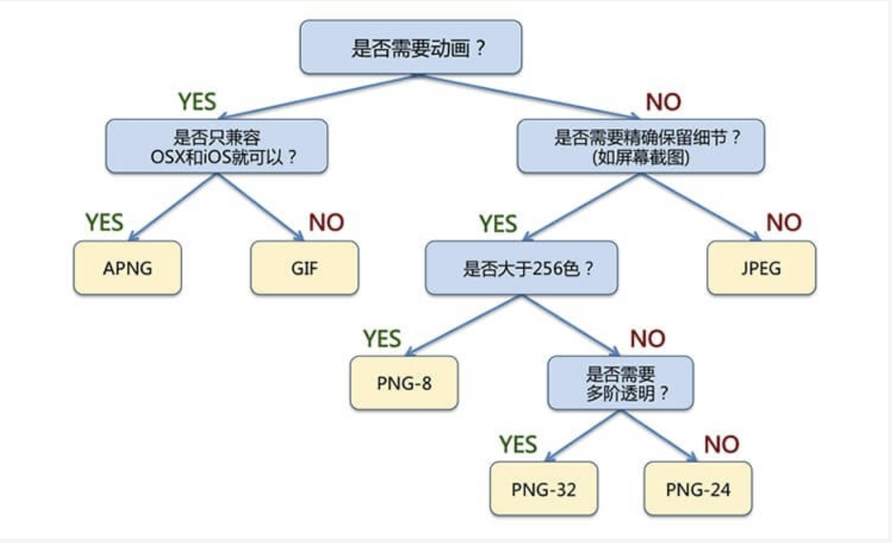

# 图片格式
1. PNG：无损压缩的位图图形格式，支持透明。
  - 优点：无损压缩、色彩表现力强。
  - 应用场景：网站logo、颜色简单但对图片质量高、雪碧图
2. JPG / JEPG：有损压缩，不支持透明
  - 分类：
      - Baseline JPEG格式：图片从上到下一条条加载
      - Progressive JPEG格式：图片从小分辨率到正常分辨率
  - 优点：压缩程度在60%-70%表现依然好，体积小
  - 应用场景：大图例如：banner图片、列表图片
3. GIF：动图
  - 应用场景：loading等动画图片
4. SVG：可缩放矢量图
  - 优点：不会失帧、体积小能被代码修改
  - 缺点：兼容性差、对渲染要求高
  - 应用场景：数据可视化，例如地图、表格
5. WebP：谷歌开发的加快图片加载速度的图片格式
  - 优点：体积比png小，速度更快，色彩更多，支持透明
  - 缺点：兼容性查
6. Base64：基于64个可打印字符来表示二进制数据的方法
  - 优点：嵌入html，不用发送请求
  - 应用场景：小图标
 

