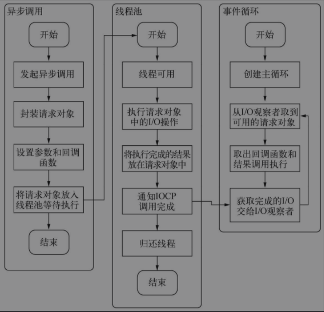
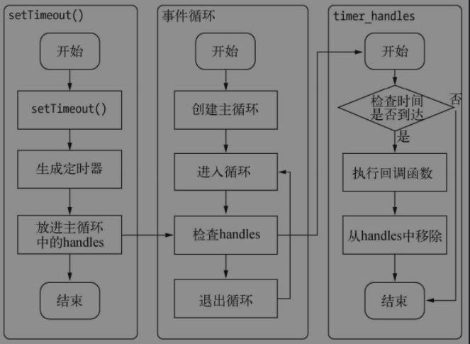
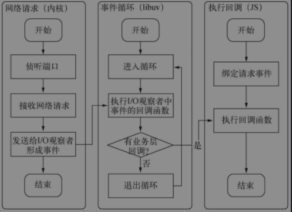

# 03异步IO
事件驱动的实质：通过主循环加事件触发的方式来运行程序

## 事件循环
1. 开始
2. 循环体
   1. 是否有事件？
   2. 有关联回调？
   3. 回到2
3. 退出
每执行一次循环体的过程我们称为Tick

## 整个异步I/O的流程


## 延迟执行
1. 定时器不一定准确
2. process.nextTick：在下一轮Tick时取出执行
3. setImmediate

优先级：process.nextTick > setImmediate

```javascript
// 加入两个nextTick()的回调函数
process.nextTick(function () {
  console.log('nextTick延迟执行1');
});
process.nextTick(function () {
  console.log('nextTick延迟执行2');
});
// 加入两个setImmediate()的回调函数
setImmediate(function () {
  console.log('setImmediate延迟执行1');
  // 进入下次循环
  process.nextTick(function () {
    console.log(’强势插入’);
  });
});
setImmediate(function () {
  console.log('setImmediate延迟执行2');
});
console.log(’正常执行’);

// 正常执行
// nextTick延迟执行1
// nextTick延迟执行2
// setImmediate延迟执行1
// 强势插入
// setImmediate延迟执行2
```

定时器执行流程


## 处理请求
