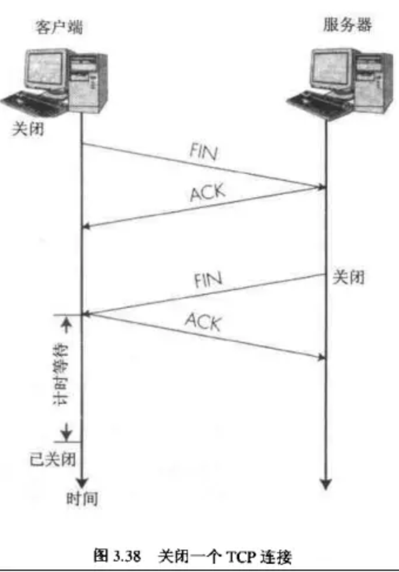

# TCP
传输控制协议

## 字段
- seq：序号，判断是否有序
- ack：对另一端seq的回应
- win：滑动窗口，表示可以接收多少个数据包

## 三次握手
- 浏览器向服务器发送建立TCP连接的数据包，返回seq=0数据包，浏览器进入等待状态
- 服务器接收到请求建立TCP的数据包，返回seq=0、ack=1数据包，服务器进入等待连接状态（ack = 对方seq + 1 = 1。表示收到）
- 浏览器接受到数据包，返回seq=1,ack=1数据包，浏览器进入连接状态（ack = 对方seq + 1 = 1。表示收到）
- 服务器接收到数据包，服务器进入连接状态，与浏览器建立TCP连接

为什需要三次握手？
目的：为了防止已失效的连接请求报文段突然又传送到了服务端，因而产生错误，浪费资源
假如不采取三次握手，client发出的第一个连接请求报文段，时间过长而失效。server发出确认连接，而浏览器并不知情。此时服务器一直等待client发来数据，从而浪费资源。

## 四次挥手
- 浏览器发送FIN数据包给服务器，以关闭连接，浏览器进入等待关闭状态
- 服务器接收数据包，发送ACK数据包给浏览器，服务器进入等待关闭状态
- 服务器发送FIN数据包，表示剩余数据包以全部发送完毕，进入可以关闭状态
- 浏览器接受到FIN数据包后，浏览器发送ACK数据包给服务器
- 服务器接收ACK数据包，关闭连接

为什么关闭连接是四次挥手呢？
当服务器接收到浏览器FIN数据包时，需回响应此数据包，不然浏览器可能认为数据包丢失
而服务器在发送FIN之前，可能浏览器请求的数据包还没有发送完，等待数据包发送完后，服务器响应FIN数据包表示可以关闭连接

## 丢包
如果包没有连续到达，比如1到了，2没到，3，4，5也到了，
这个时候，B始终返回ACK=2，代表只确认1，然后A就知道2没到，重新发2，
B一旦收到2会直接ACK=6给A，这个的意思就是说2拿到后，345也收到了，直接给6就ok，

## 参考
- [作为前端的你了解多少tcp的内容](https://juejin.im/post/5c078058f265da611c26c235#heading-12)
