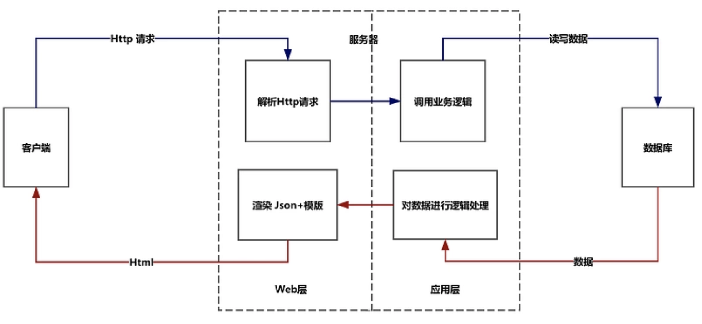
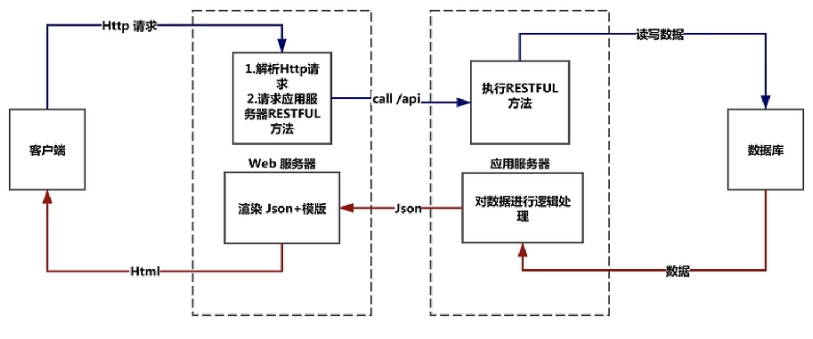
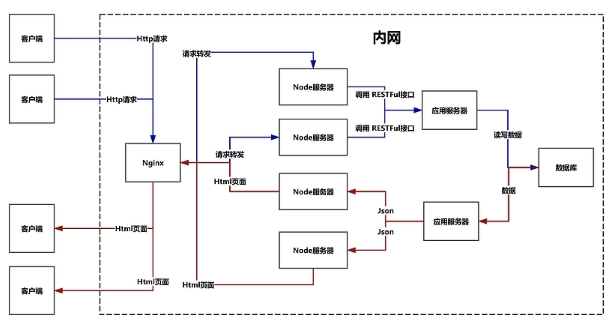

# BS架构和CS架构

## 1.CS架构
Client/Server：客户机/服务器模式。例如QQ等
- 客户机：界面显示 + 业务逻辑
- 服务器：业务逻辑 + 数据库

条件：需要下载一个客户端

优点：
- 表现能力强
- 安全
- 运行速度较快

缺点：
- 适用面窄，通常用于局域网中
- 用户群固定。由于程序需要安装才可使用，因此不适合面向一些不可知的用户。
- 维护成本高，发生一次升级，则所有客户端的程序都需要改变

## 2.BS架构
Brower/Server：浏览器/服务器模式。
- 浏览器：界面显示
- 服务器：业务逻辑
- 数据库：处理数据

条件：只需浏览器，无需安装应用

优点：
- 无需安装
- 跨平台：BS架构可以直接放在广域网上，通过一定的权限控制实现多客户访问的目的，交互性较强
- 易维护：BS架构无需升级多个客户端，升级服务器即可。可以随时更新版本，而无需用户重新下载啊什么的

缺点：
- 运行速度慢
- 不安全
- 表现能力弱

## 3.B/S工作原理
- 客户端-服务器-数据库
- 客户端－web服务器－应用服务器－数据库
- 客户端－负载均衡器(Nginx)－中间服务器(Node)－应用服务器－数据库

### 3.1 客户端-服务器-数据库

1. 客户端向服务器发起Http请求
2. 服务器中的web服务层能够处理Http请求
3. 服务器中的应用层部分调用业务逻辑，调用业务逻辑上的方法
4. 如果有必要，服务器会和数据库进行数据交换. 然后将模版＋数据渲染成最终的Html, 返送给客户端

### 3.2 客户端－web服务器－应用服务器－数据库

1. 客户端向web服务器发起Http请求
2. web服务能够处理Http请求，并且调用应用服务器暴露在外的RESTFUL接口
3. 应用服务器的RESTFUL接口被调用，会执行对应的暴露方法.如果有必要和数据库进行数据交互，应用服务器会和数据库进行交互后，将json数据返回给web服务器
4. web服务器将模版＋数据组合渲染成html返回给客户端

### 3.3 客户端－负载均衡器(Nginx)－中间服务器(Node)－应用服务器－数据库

1. 整正暴露在外的不是真正web服务器的地址，而是负载均衡器器的地址
2. 客户向负载均衡器发起Http请求
3. 负载均衡器能够将客户端的Http请求均匀的转发给Node服务器集群
4. Node服务器接收到Http请求之后，能够对其进行解析，并且能够调用应用服务器暴露在外的RESTFUL接口
5. 应用服务器的RESTFUL接口被调用，会执行对应的暴露方法.如果有必要和数据库进行数据交互，应用服务器会和数据库进行交互后，将json数据返回给Node
6. Node层将模版＋数据组合渲染成html返回反向代理服务器
7. 反向代理服务器将对应html返回给客户端

Nginx优点：
- 处理高并发
- 处理跨域
- 缓存资源
- 保护服务器

## 参考
- [B/S架构及其运行原理](https://www.cnblogs.com/erhanhan/p/8142627.html)
- [作为前端需要了解的B/S架构](https://www.cnblogs.com/xianyulaodi/p/5986748.html)
