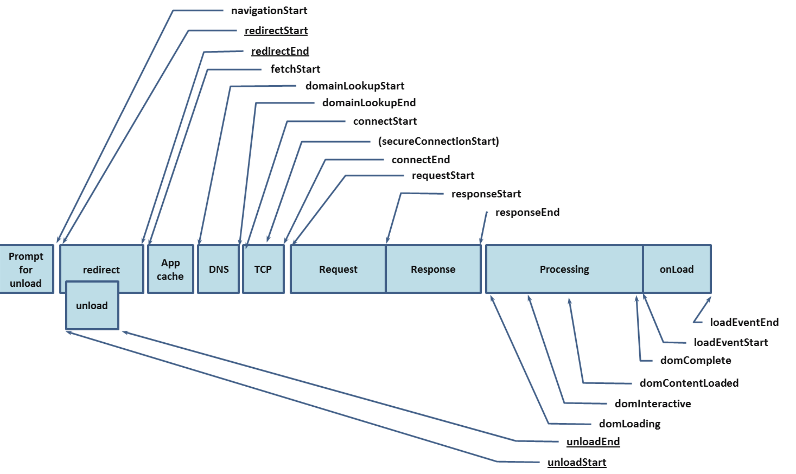

# 异常上报与性能监控

## 捕获异常
- try...catch
- window.onerror || addEventListener：对于跨域的脚本，需要对script标签增加一个crossorigin=”anonymous”；
- 生产环境：使用source-map来解决
- React：ErrorBoundary + componentDidCatch

## 性能监控
- window.performance API

```javascript
// 获取 performance 数据
var performance = {  
    // memory 是非标准属性，只在 Chrome 有
    // 财富问题：我有多少内存
    memory: {
        usedJSHeapSize:  16100000, // JS 对象（包括V8引擎内部对象）占用的内存，一定小于 totalJSHeapSize
        totalJSHeapSize: 35100000, // 可使用的内存
        jsHeapSizeLimit: 793000000 // 内存大小限制
    },
 
    //  哲学问题：我从哪里来？
    navigation: {
        redirectCount: 0, // 如果有重定向的话，页面通过几次重定向跳转而来
        type: 0           // 0   即 TYPE_NAVIGATENEXT 正常进入的页面（非刷新、非重定向等）
                          // 1   即 TYPE_RELOAD       通过 window.location.reload() 刷新的页面
                          // 2   即 TYPE_BACK_FORWARD 通过浏览器的前进后退按钮进入的页面（历史记录）
                          // 255 即 TYPE_UNDEFINED    非以上方式进入的页面
    },
 
    timing: {
        // 在同一个浏览器上下文中，前一个网页（与当前页面不一定同域）unload 的时间戳，如果无前一个网页 unload ，则与 fetchStart 值相等
        navigationStart: 1441112691935,
 
        // 前一个网页（与当前页面同域）unload 的时间戳，如果无前一个网页 unload 或者前一个网页与当前页面不同域，则值为 0
        unloadEventStart: 0,
 
        // 和 unloadEventStart 相对应，返回前一个网页 unload 事件绑定的回调函数执行完毕的时间戳
        unloadEventEnd: 0,
 
        // 第一个 HTTP 重定向发生时的时间。有跳转且是同域名内的重定向才算，否则值为 0 
        redirectStart: 0,
 
        // 最后一个 HTTP 重定向完成时的时间。有跳转且是同域名内部的重定向才算，否则值为 0 
        redirectEnd: 0,
 
        // 浏览器准备好使用 HTTP 请求抓取文档的时间，这发生在检查本地缓存之前
        fetchStart: 1441112692155,
 
        // DNS 域名查询开始的时间，如果使用了本地缓存（即无 DNS 查询）或持久连接，则与 fetchStart 值相等
        domainLookupStart: 1441112692155,
 
        // DNS 域名查询完成的时间，如果使用了本地缓存（即无 DNS 查询）或持久连接，则与 fetchStart 值相等
        domainLookupEnd: 1441112692155,
 
        // HTTP（TCP） 开始建立连接的时间，如果是持久连接，则与 fetchStart 值相等
        // 注意如果在传输层发生了错误且重新建立连接，则这里显示的是新建立的连接开始的时间
        connectStart: 1441112692155,
 
        // HTTP（TCP） 完成建立连接的时间（完成握手），如果是持久连接，则与 fetchStart 值相等
        // 注意如果在传输层发生了错误且重新建立连接，则这里显示的是新建立的连接完成的时间
        // 注意这里握手结束，包括安全连接建立完成、SOCKS 授权通过
        connectEnd: 1441112692155,
 
        // HTTPS 连接开始的时间，如果不是安全连接，则值为 0
        secureConnectionStart: 0,
 
        // HTTP 请求读取真实文档开始的时间（完成建立连接），包括从本地读取缓存
        // 连接错误重连时，这里显示的也是新建立连接的时间
        requestStart: 1441112692158,
 
        // HTTP 开始接收响应的时间（获取到第一个字节），包括从本地读取缓存
        responseStart: 1441112692686,
 
        // HTTP 响应全部接收完成的时间（获取到最后一个字节），包括从本地读取缓存
        responseEnd: 1441112692687,
 
        // 开始解析渲染 DOM 树的时间，此时 Document.readyState 变为 loading，并将抛出 readystatechange 相关事件
        domLoading: 1441112692690,
 
        // 完成解析 DOM 树的时间，Document.readyState 变为 interactive，并将抛出 readystatechange 相关事件
        // 注意只是 DOM 树解析完成，这时候并没有开始加载网页内的资源
        domInteractive: 1441112693093,
 
        // DOM 解析完成后，网页内资源加载开始的时间
        // 在 DOMContentLoaded 事件抛出前发生
        domContentLoadedEventStart: 1441112693093,
 
        // DOM 解析完成后，网页内资源加载完成的时间（如 JS 脚本加载执行完毕）
        domContentLoadedEventEnd: 1441112693101,
 
        // DOM 树解析完成，且资源也准备就绪的时间，Document.readyState 变为 complete，并将抛出 readystatechange 相关事件
        domComplete: 1441112693214,
 
        // load 事件发送给文档，也即 load 回调函数开始执行的时间
        // 注意如果没有绑定 load 事件，值为 0
        loadEventStart: 1441112693214,
 
        // load 事件的回调函数执行完毕的时间
        loadEventEnd: 1441112693215
 
        // 字母顺序
        // connectEnd: 1441112692155,
        // connectStart: 1441112692155,
        // domComplete: 1441112693214,
        // domContentLoadedEventEnd: 1441112693101,
        // domContentLoadedEventStart: 1441112693093,
        // domInteractive: 1441112693093,
        // domLoading: 1441112692690,
        // domainLookupEnd: 1441112692155,
        // domainLookupStart: 1441112692155,
        // fetchStart: 1441112692155,
        // loadEventEnd: 1441112693215,
        // loadEventStart: 1441112693214,
        // navigationStart: 1441112691935,
        // redirectEnd: 0,
        // redirectStart: 0,
        // requestStart: 1441112692158,
        // responseEnd: 1441112692687,
        // responseStart: 1441112692686,
        // secureConnectionStart: 0,
        // unloadEventEnd: 0,
        // unloadEventStart: 0
    }
};
```
```javascript
// 计算加载时间
function getPerformanceTiming() {
    var performance = window.performance;
    if (!performance) {
        // 当前浏览器不支持
        console.log('你的浏览器不支持 performance 接口');
        return;
    }
    var t = performance.timing;
    var times = {};
    //【重要】页面加载完成的时间
    //【原因】这几乎代表了用户等待页面可用的时间
    times.loadPage = t.loadEventEnd - t.navigationStart;
    //【重要】解析 DOM 树结构的时间
    //【原因】反省下你的 DOM 树嵌套是不是太多了！
    times.domReady = t.domComplete - t.responseEnd;
    //【重要】重定向的时间
    //【原因】拒绝重定向！比如，http://example.com/ 就不该写成 http://example.com
    times.redirect = t.redirectEnd - t.redirectStart;
    //【重要】DNS 查询时间
    //【原因】DNS 预加载做了么？页面内是不是使用了太多不同的域名导致域名查询的时间太长？
    // 可使用 HTML5 Prefetch 预查询 DNS ，见：[HTML5 prefetch](http://segmentfault.com/a/1190000000633364)            
    times.lookupDomain = t.domainLookupEnd - t.domainLookupStart;
    //【重要】读取页面第一个字节的时间
    //【原因】这可以理解为用户拿到你的资源占用的时间，加异地机房了么，加CDN 处理了么？加带宽了么？加 CPU 运算速度了么？
    // TTFB 即 Time To First Byte 的意思
    // 维基百科：https://en.wikipedia.org/wiki/Time_To_First_Byte
    times.ttfb = t.responseStart - t.navigationStart;
    //【重要】内容加载完成的时间
    //【原因】页面内容经过 gzip 压缩了么，静态资源 css/js 等压缩了么？
    times.request = t.responseEnd - t.requestStart;
    //【重要】执行 onload 回调函数的时间
    //【原因】是否太多不必要的操作都放到 onload 回调函数里执行了，考虑过延迟加载、按需加载的策略么？
    times.loadEvent = t.loadEventEnd - t.loadEventStart;
    // DNS 缓存时间
    times.appcache = t.domainLookupStart - t.fetchStart;
    // 卸载页面的时间
    times.unloadEvent = t.unloadEventEnd - t.unloadEventStart;
    // TCP 建立连接完成握手的时间
    times.connect = t.connectEnd - t.connectStart;
    return times;
}
```

## 数据上报
- img
- ajax
- setRequestHeader：如果上报的性能和日志数据高频触发，则可以在页面unload时统一上报。而unload时的异步请求又可能会被浏览器所忽略，且不能改为同步请求。可用navigator.sendBeacon，使用户代理在有机会时异步地向服务器发送数据

```javascript
if (XMLHttpRequest) {
  var xhr = new XMLHttpRequest();
  xhr.open('post', 'https://log.xxx.com', true); // 上报给node中间层处理
  xhr.setRequestHeader('Content-Type', 'application/json'); // 设置请求头
  xhr.send(JSON.stringify(errorObj)); // 发送参数
}
```

## 参考
[前端性能与异常上报](https://juejin.im/post/5b5dcfb46fb9a04f8f37afbb#heading-0)
