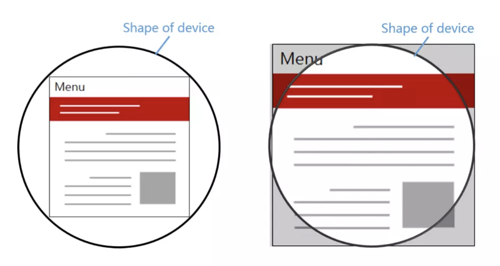

# 移动端适配

## 1.英寸
英寸：描述屏幕的物理大小
屏幕n寸：屏幕对角线的长度

1英寸 = 2.54 厘米

## 2. 分辨率
### 2.1 物理像素
物理像素：图片或电子屏幕的最小组成单位

### 2.2 分辨率
分辨率：一个屏幕具体由多少个***物理像素点***组成
1. 屏幕分辨率
2. 图像分辨率
例如：iPhone SE分辨率：1136 x 640，表示在垂直和水平上所具有的物理像素点。

### 2.3 PPI
PPI(Pixel Per Inch)：每英寸包括的物理像素点。用于描述屏幕的清晰度以及一张图片的质量
例如iphone 6的PPI（对角线每一英寸包含的物理像素点）：（水平物理像素点的平方 + 垂直物理像素点的平方）开根号 / 对象线英寸


### 2.4 DPI
DPI(Dot Per Inch)：即每英寸包括的点数
这里的点是一个抽象的单位，它可以是屏幕像素点、图片像素点也可以是打印机的墨点

## 3.设备独立像素（css像素）
设备独立像素(Device Independent Pixels)简称DIP或DP：逻辑像素（css像素），告诉不同分辨率的手机，它们在界面上显示元素的大小是多少

例子：在iPhone4使用的视网膜屏幕中，把2x2个像素当1个像素使用，这样让屏幕看起来更精致，但是元素的大小却不会改变


物理像素 in 设备独立像素 in (图片 or 屏幕)
 ```javascript
var PX = {
  0: '物理像素',
  1: '物理像素'
}
var image = {
  0: PX,
  1: PX,
}
```

### 3.1 设备像素比
设备像素比dpr（device pixel ratio）：物理像素 / 设备独立像素
- 在web中，浏览器为我们提供了window.devicePixelRatio来获取dpr
- 在css中，可以使用媒体查询min-device-pixel-ratio，区分dpr

### 3.2 移动端开发
设备独立像素 = pt = dp
- iOS的尺寸单位为pt
- Android的尺寸单位为dp

### 3.3 WEB端开发
设备独立像素 = css像素（当页面缩放比例为100%时）
页面的缩放系数 = css像素 / 设备独立像素

### 3.4 关于屏幕
Retina屏幕只是苹果提出的一个营销术语，让多个物理像素渲染一个独立像素只是Retina屏幕为了达到效果而使用的一种技术。而不是所有DPR > 1的屏幕就是Retina屏幕。
`P` ：屏幕***纵向***的像素个数。1080P即纵向有1080个像素，分辨率为1920X1080的屏幕就属于1080P屏幕
`K`：屏幕***横向***有几个1024个像素。一般来讲横向像素超过2048就属于2K屏，横向像素超过4096就属于4K屏。

## 4.视口
视口(viewport)：在Web浏览器术语中，通常与浏览器窗口相同，但不包括浏览器的UI， 菜单栏等——即指你正在浏览的文档的那一部分。
- 布局视口
- 视觉视口
- 理想视口

### 4.1 布局视口
布局视口(layout viewport)：布局视口是网页布局的基准窗口（document.documentElement.clientWidth / clientHeight）

- PC浏览器：等于当前浏览器的窗口大小（不包括borders 、margins、滚动条）
- 移动端：默认值，大部分为980px，用户可以手动对网页进行放大 
 

### 4.2 视觉视口
视觉视口(visual viewport)：用户通过屏幕真实看到的区域（window.innerWidth / innerHeight）


### 4.3 理想视口
理想视口(ideal viewport)：网站页面在移动端展示的理想大小（screen.width / height）

当页面缩放比例为100%时：
- CSS像素 = 设备独立像素
- 理想视口 = 视觉视口

### 4.4 Meta viewport
可以借助<meta>元素的viewport来帮助我们设置视口、缩放等，从而让移动端得到更好的展示效果
- width：以pixels（像素）为单位， 定义布局视口的宽度
- height：以pixels（像素）为单位， 定义布局视口的高度。
- initial-scale：定义页面初始缩放比率。
- minimum-scale：定义缩放的最小值；必须小于或等于maximum-scale的值。
- maximum-scale：定义缩放的最大值；必须大于或等于minimum-scale的值。
- user-scalable：如果设置为 no，用户将不能放大或缩小网页。默认值为 yes。

```html
<meta name="viewport" content="width=device-width; initial-scale=1; maximum-scale=1; minimum-scale=1; user-scalable=no;">
```

### 4.5 移动端适配
为了在移动端让页面获得更好的显示效果，我们必须让布局视口、视觉视口都尽可能等于理想视口。

- width=device-width：让布局视口等于理想视口
- initial-scale=1：让视觉视口等于理想视口（initial-scale = 理想视口宽度 / 视觉视口宽度）

这时，1个CSS像素就等于1个设备独立像素

### 4.6 缩放
布局视口宽度取的是width和视觉视口宽度的最大值。

例如：
若手机的理想视口宽度为400px，设置width=device-width，initial-scale=2，此时视觉视口宽度 = 理想视口宽度 / initial-scale = 200px，布局视口取两者最大值即device-width 400px。
若设置width=device-width，initial-scale=0.5，此时视觉视口宽度 = 理想视口宽度 / initial-scale即800px，布局视口取两者最大值即800px。

### 4.7 获取浏览器大小
- window.innerHeight：获取浏览器视觉视口高度（包括垂直滚动条）。
- window.outerHeight：获取浏览器窗口外部的高度。表示整个浏览器窗口的高度，包括侧边栏、窗口镶边和调正窗口大小的边框。
- window.screen.Height：获取获屏幕取理想视口高度，这个数值是固定的，设备的分辨率/设备像素比
- window.screen.availHeight：浏览器窗口可用的高度。
- document.documentElement.clientHeight：获取浏览器布局视口高度，包括内边距，但不包括垂直滚动条、边框和外边距。
- document.documentElement.offsetHeight：包括内边距、滚动条、边框和外边距。
- document.documentElement.scrollHeight：在不使用滚动条的情况下适合视口中的所有内容所需的最小宽度。测量方式与clientHeight相同：它包含元素的内边距，但不包括边框，外边距或垂直滚动条。


## 5.1px问题
1. border-image
2. background-image
3. 伪类 + transform
4. svg
5. 设置viewport：通过设置缩放，让CSS像素等于真正的物理像素（flexible方案）

## 6.移动端适配方案
### 6.1 flexible方案
采用rem来计算：rem 是相对于html节点的font-size来做计算的。
例如以iPhone6为例：布局视口为375px，假设1rem = (375 / 10)px = 37.5px。元素宽度75px，那么设置元素为75 / 37.5 = 2rem。
当布局视口为414px时（iPhone6 plus），1rem = (414 / 10) = 41.4px，那么元素在此时为2rem * 41.4 = 82.8px，达到适配效果。

```javascript
// set 1rem = viewWidth / 10
function setRemUnit () {
    var rem = docEl.clientWidth / 10
    docEl.style.fontSize = rem + 'px'
}
setRemUnit();
```
### 6.2 vh、vw方案
vh、vw方案即将视觉视口宽度 window.innerWidth和视觉视口高度 window.innerHeight 等分为 100 份。
- vw(Viewport's width)：1vw等于视觉视口的1%
- vh(Viewport's height) :1vh 为视觉视口高度的1%
- vmin : vw 和 vh 中的较小值
- vmax : 选取 vw 和 vh 中的较大值

例如以iPhone6为例：布局视口为375px，假设1vw = 3.75px。元素宽度75px，那么设置元素为75 / 3.75 = 20vw。
当布局视口为414px时（iPhone6 plus），1rem = 4.14px，那么元素在此时为20vw * 4.14 = 82.8px，达到适配效果。

vw同样有一定的缺陷：
- px转换成vw不一定能完全整除，因此有一定的像素差。
- 比如当容器使用vw，margin采用px时，很容易造成整体宽度超过100vw，从而影响布局效果。当然我们也是可以避免的，例如使用padding代替margin，结合calc()函数使用等等...

## 7.适配iPhoneX
### 7.1 安全区域
安全区域就是一个不受圆角（corners）、刘海（sensor housing）和小黑条（Home Indicator）的可视窗口范围

### 7.2 viewport-fit
- contain: 可视窗口完全包含网页内容（左图）
- cover：网页内容完全覆盖可视窗口（右图）
- auto：默认，跟 contain 表现一致



```html
<meta name="viewport" content="width=device-width,initial-scale=1.0, minimum-scale=1.0, maximum-scale=1.0, user-scalable=no, viewport-fit=cover">
```

### 7.3 env、constant
我们需要将顶部和底部合理的摆放在安全区域内，iOS11新增了两个CSS函数env（ios >= 11.2）、constant（ios <= 11.2），用于设定安全区域与边界的距离
- safe-area-inset-left：安全区域距离左边边界距离
- safe-area-inset-right：安全区域距离右边边界距离
- safe-area-inset-top：安全区域距离顶部边界距离
- safe-area-inset-bottom：安全区域距离底部边界距离

```html
<meta name="viewport" content="viewport-fit=cover">
<style>
body {
    padding-top: constant(safe-area-inset-top);   //为导航栏+状态栏的高度 88px            
    padding-left: constant(safe-area-inset-left);   //如果未竖屏时为0                
    padding-right: constant(safe-area-inset-right); //如果未竖屏时为0                
    padding-bottom: constant(safe-area-inset-bottom);//为底下圆弧的高度 34px       
}
</style>
```

## 8.横屏适配
1. JavaScript检测横屏：window.orientation
```javascript
window.addEventListener("resize", ()=>{
  if (window.orientation === 180 || window.orientation === 0) { 
    // 正常方向或屏幕旋转180度
      console.log('竖屏');
  };
  if (window.orientation === 90 || window.orientation === -90 ){ 
     // 屏幕顺时钟旋转90度或屏幕逆时针旋转90度
      console.log('横屏');
  }  
}); 
```
2. CSS检测横屏
```css
@media screen and (orientation: portrait) {
  /*竖屏...*/
} 
@media screen and (orientation: landscape) {
  /*横屏...*/
}
```

## 9.图片模糊问题
### 9.1 产生原因
在dpr > 1的屏幕上，位图的一个像素可能由多个物理像素来渲染，然而这些物理像素点并不能被准确的分配上对应位图像素的颜色，只能取近似值，所以相同的图片在dpr > 1的屏幕上就会模糊


### 9.2 解决方案
一个屏幕像素来渲染一个图片像素

### 9.3 media查询
只适用于背景图
```css
.avatar{
  background-image: url(conardLi_1x.png);
}
@media only screen and (-webkit-min-device-pixel-ratio:2){
  .avatar{
    background-image: url(conardLi_2x.png);
  }
}
@media only screen and (-webkit-min-device-pixel-ratio:3){
  .avatar{
    background-image: url(conardLi_3x.png);
  }
}
```

### 9.4 image-set
只适用于背景图
```css
.avatar {
  background-image: -webkit-image-set( "conardLi_1x.png" 1x, "conardLi_2x.png" 2x );
}
```

### 9.5 srcset
```html

```

### 9.6 JavaScript拼接图片url
```javascript
const dpr = window.devicePixelRatio;
const images =  document.querySelectorAll('img');
images.forEach((img)=>{
  img.src.replace(".", `@${dpr}x.`);
})
```

### 9.7 使用svg
```html


<style>
.avatar {
  background: url(conardLi.svg);
}
</style>
```

## 10.参考
[关于移动端适配，你必须要知道的](https://juejin.im/post/5cddf289f265da038f77696c#heading-0)
