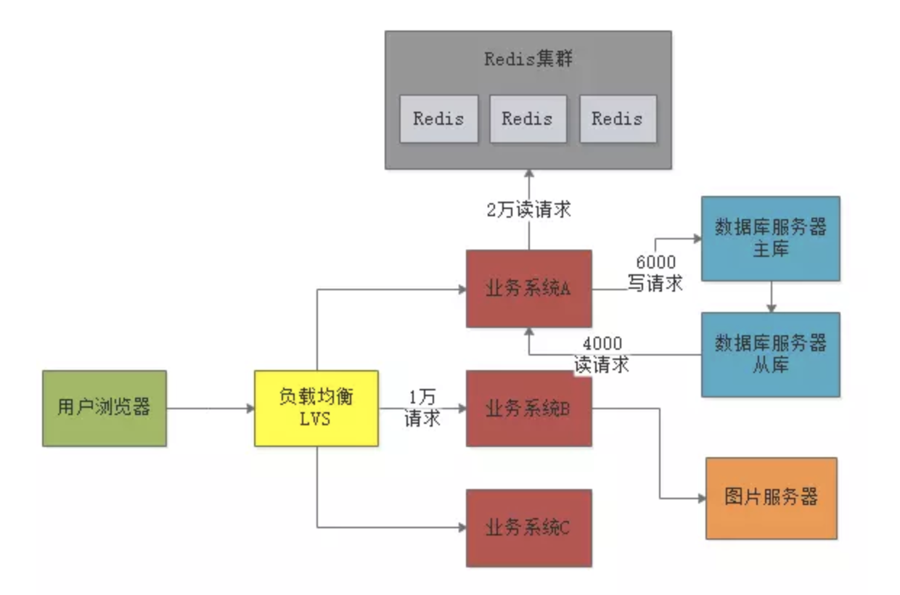
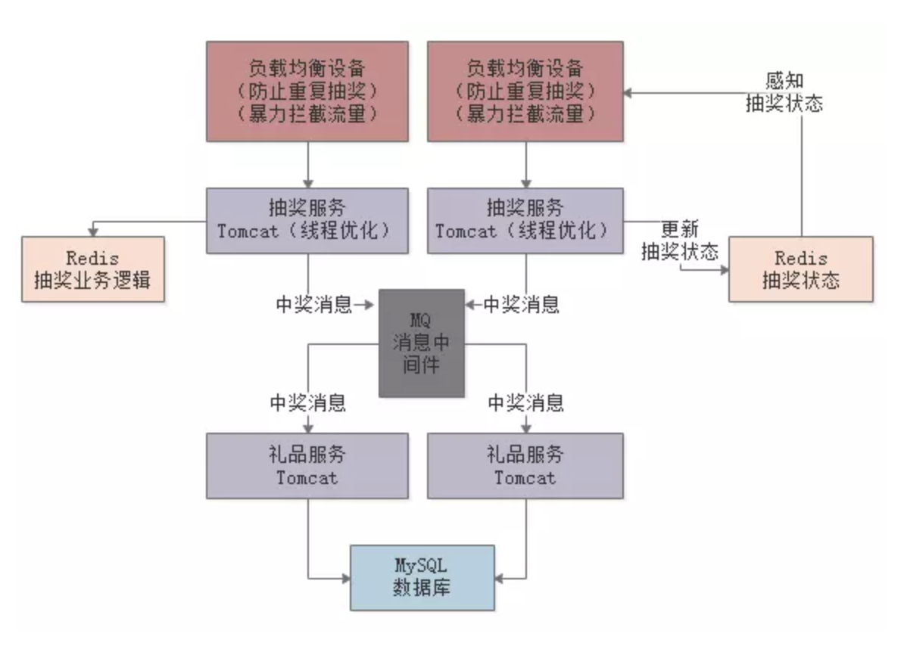
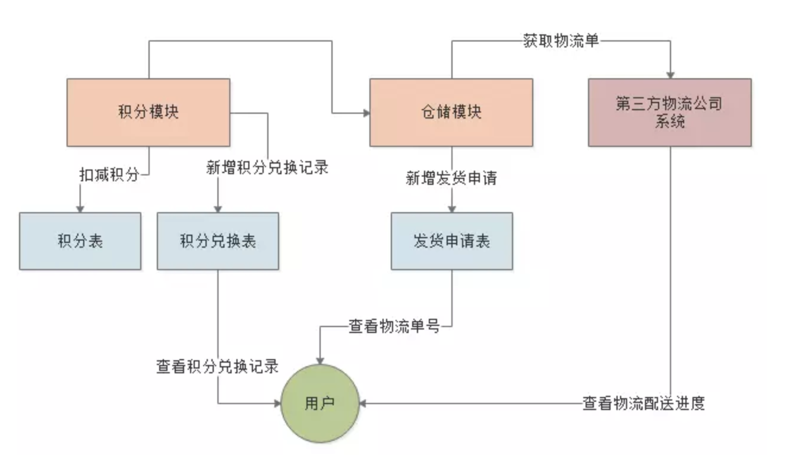
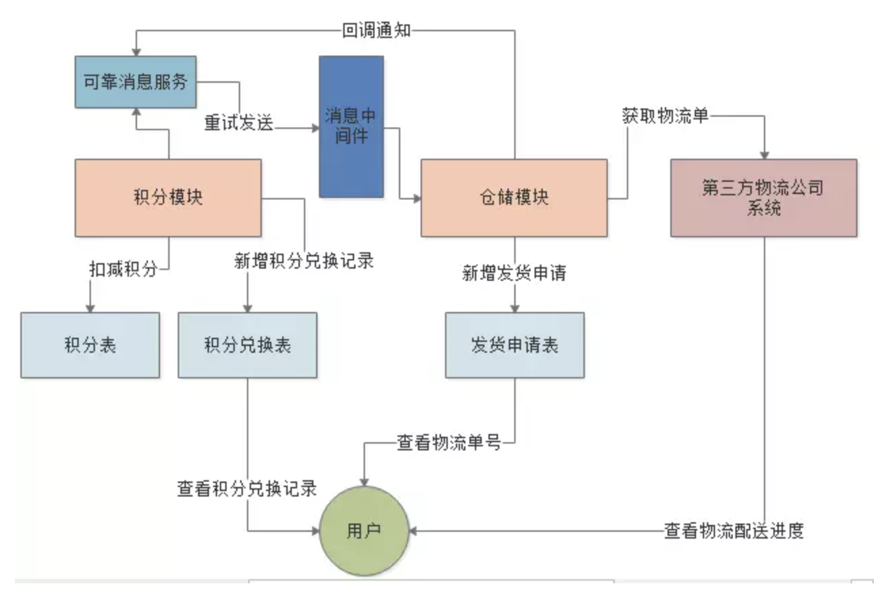

# 高并发架构
三台服务器：
- 应用程序
- 数据库服务
- 图片服务器

优化：
- 负载均衡：分散对单一服务器的请求
- 数据库主从架构：一旦主库出现问题，可以迅速使用从库继续提供数据库服务
    - 主数据库服务器
    - 从数据库服务器
- 业务垂直拆分：单一应用服务器处理所有业务 => 多台业务服务器处理
- Redis缓存集群：缓存相同的请求处理
- 主从数据库服务器读写分离
    - 主数据库服务器：写请求
    - 从数据库服务器：读请求

## 应用：如何设计一个百万级用户的抽奖系统
举个例子：抽奖、抢红包、秒杀。在某个时间点会瞬间涌入大量的人来点击系统，给系统造成瞬间高于平时百倍、千倍甚至几十万倍的流量压力。
业务场景：某个时间点有1万个奖，中奖会联动调用礼品服务

系统：
- 抽奖系统
- 礼品服务
- 数据库服务器

优化：
- 负载均衡层的限流
    - 防止用户重复抽奖：限制同一个用户多次抽奖
    - 全部开奖后暴力拦截流量：开奖后不中奖的请求给拦截掉，不需要抽奖系统处理这部分的请求
        - 问题：抽奖系统和负载均衡如何得知已经开奖
        - 解决：基于Redis来实现共享抽奖状态，当抽奖系统设置已经开奖后，负载均衡通知Redis的抽奖状态得知已经开奖，拦截不中奖的请求
- Tomcat线程数量的优化：一个请求用一个线程处理。Tomcat线程数量在200~500之间
- 基于Redis实现抽奖业务逻辑
    - 问题：数据库MySQL能抗不住2万的并发请求
    - 解决：把MySQL给替换成Redis
- 发放礼品环节进行限流削峰
    - 问题：1万请求抽中了奖品，会造成抽奖服务对礼品服务调用1万次
    - 解决：对并发无要求，所以让礼品服务慢慢延迟发放奖品。引入消息中间件，进行限流削峰

## 应用：设计一个电商平台积分兑换系统
业务场景：
- 用户在电商平台里平时通过购买商品、晒单评论可以有不断的积累积分
- 积累到足够的积分后，就可以在电商平台的积分兑换页面中，选择使用自己的积分来兑换一些礼品

设计：
- 积分表：专门用来存储每个用户的积分
    - id（自增id主键）
    - user_id（用户id）
    - credit（积分）
- 积分兑换记录表：记录下来你这个用户本次用多少积分兑换了一件什么商品
    - id（自增id主键）
    - user_id（用户id）
    - exchanged_credit（用于兑换的积分）
    - product_id（兑换的商品id）
- 发货申请表：仓储业务模块，用来对应的商品进行发货
    - id（自增id主键）
    - type（发货类型，1：购买，2：积分兑换）
    - credit_exchange_id（外键：积分兑换表的id）
    - product_id（要发货的商品id）
    - express_no（物流单号，用来查询第三方物流）

问题1：扣减积分、新增积分兑换记录、新增发货申请单是在一个事务里的，但是不在同一个服务（积分服务和仓储服务）
解决：引入消息中间件。

问题2：仓储服务执行新增发货申请失败了怎么办
解决：引入可靠消息服务。保证仓储服务一定会完成新增发货申请这个事
1. 积分服务发送消息给可靠消息服务，可靠消息服务在消息表中新增记录，
2. 然后发送消息到MQ（消息中间件）然后仓储服务消费消息新增发货申请单
    - 如果成功就回调可靠消息服务的一个接口说自己成功了，可靠消息服务就可以更新本地消息表中的记录状态为成功
    - 如果仓储服务长时间没通知可靠消息服务自己成功了，可靠消息服务不停的重试再次发送消息

问题3：可靠消息服务过了一段时间，感觉没收到回调通知，就自己重试发送了消息，这样岂不是会让仓储服务新增两条发货申请单
解决：引入幂等性机制。在“credit_exchange_id”字段上建立一个唯一索引，保证每个积分兑换记录只能创建一条发货申请单

## 参考
- [【干货走一波】千万级用户的大型网站，应该如何设计其高并发架构？](https://juejin.im/post/5cceee97f265da03b20442df#heading-0)
- [如何设计一个百万级用户的抽奖系统？](https://juejin.im/post/5ce1975af265da1bd42450b5#heading-0)
- [如何设计一个电商平台积分兑换系统？](https://juejin.im/post/5ce3cb09f265da1b6028d816#heading-0)
